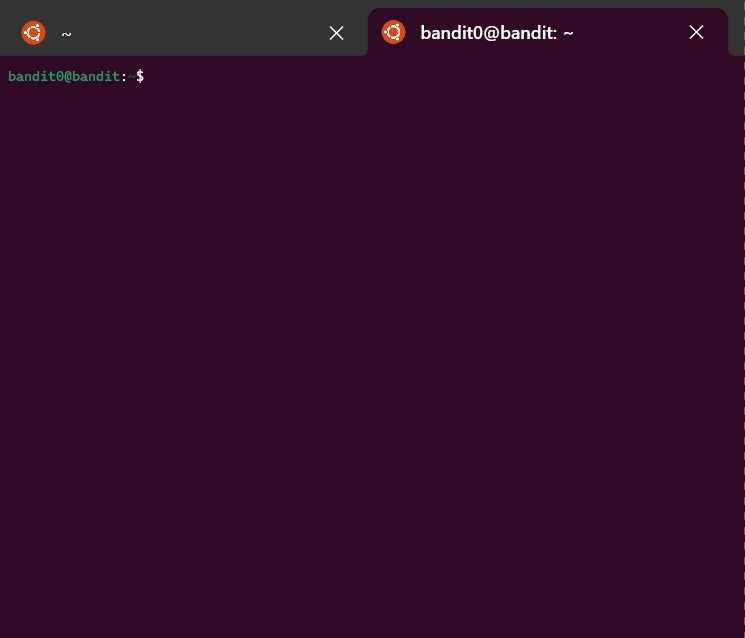
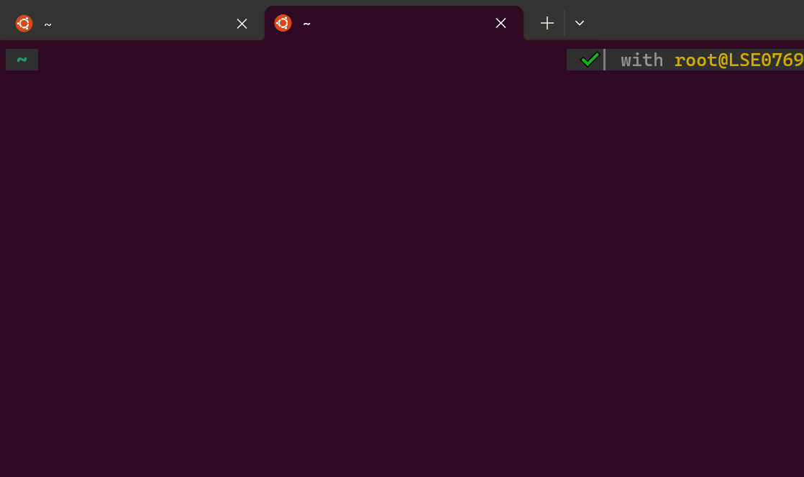
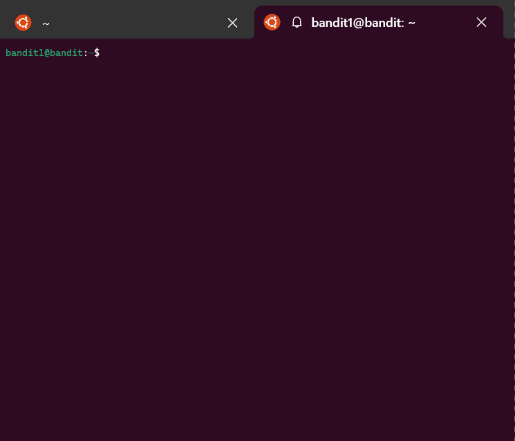
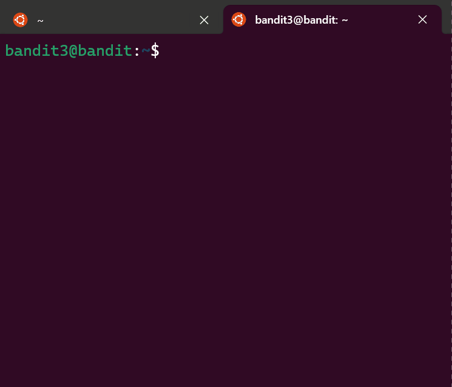
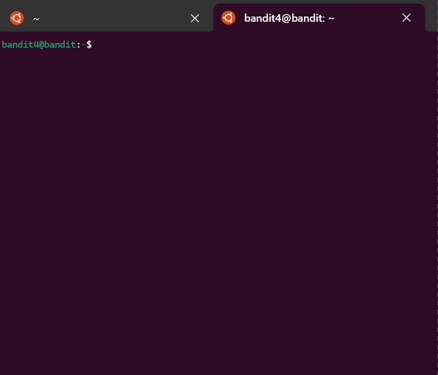
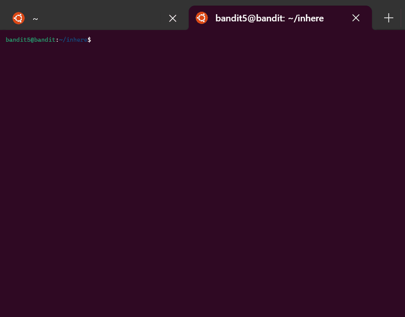
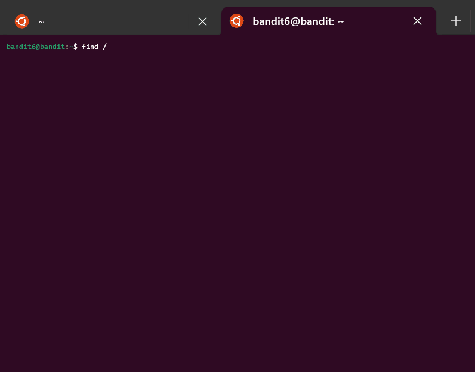
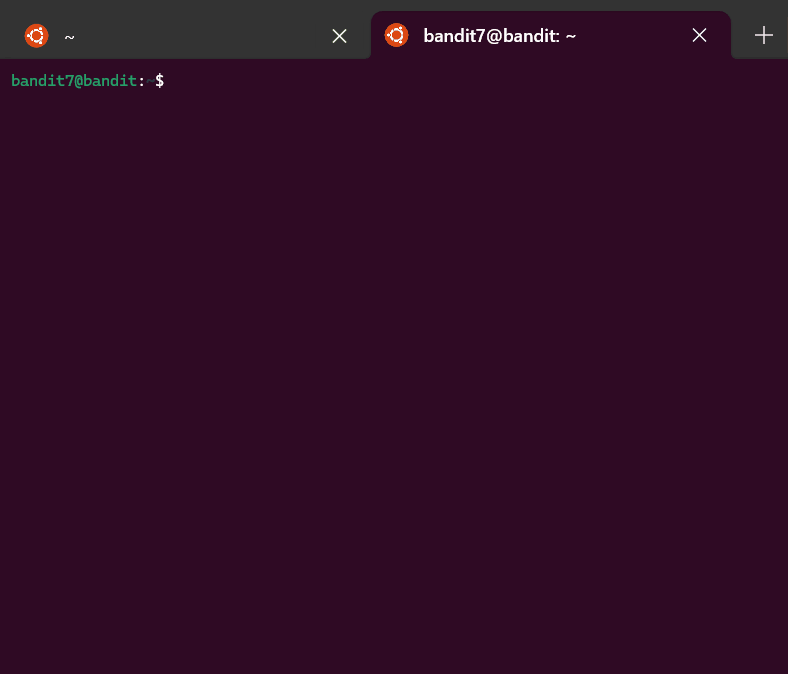

<!-- Add a custom style block with background color -->
<style>
  body {
    background-color: #201F1F;
    color: white; /* Optional: Change text color to white to improve contrast */
  }
</style>

<!-- Add Google Font for bubble/gaming effect -->
<link href="https://fonts.googleapis.com/css2?family=Press+Start+2P&display=swap" rel="stylesheet">

<h1 align="center" style="font-family: 'Press Start 2P', cursive; color: #23FF16;">
  <br>
  
  <br>
      The OverTheWire Bandit GAME
  
  <br>
</h1>

<br>

<h2 style="font-family: 'Press Start 2P', cursive; color: #23FF16;">
  My Journey with OverTheWire Bandit
</h2>


As part of my journey to mastering Linux, I recently stumbled upon the **OverTheWire Bandit** game—and honestly, it’s been a game-changer for me. I chose Bandit because I wanted a fun, interactive way to apply my Linux skills in real-world scenarios, and it came highly recommended by the CoderCo team as a great starting point.

For those who haven’t heard of it, Bandit is a wargame that helps you sharpen your Linux command-line skills in a hands-on way. Each level throws a new challenge at you, pushing you to navigate directories, manipulate files, and use different commands to find hidden passwords and unlock the next level.

## 🔍 What I’ve Learned So Far:

- **Mastering Commands**: From the basics like `ls`, `cat`, and `grep`, to more advanced commands like `find`, `xargs`, and `ssh`, Bandit has given me countless opportunities to practice and fine-tune my command-line abilities.
  
- **Problem-Solving**: Each level is like a puzzle. You need to carefully read, think critically, and sometimes experiment to figure things out. It’s really helped me become more methodical in tackling problems in Linux.

- **Scripting Practice**: Some levels require combining commands in creative ways or writing simple scripts. This has been a great way for me to improve my scripting skills.

- **Security Awareness**: Bandit also sneaks in some important security concepts, like file permissions and SSH. This has been super helpful, especially since these are things anyone working with Linux in DevOps or sysadmin roles should understand.

One of the trickiest levels I encountered involved searching for a file with specific properties using a combination of `find ./inhere -type f -size 1033c` and `cat file.txt | sort | grep`. I struggled with it for a while but finally managed to crack it! The sense of accomplishment after figuring it out was incredibly rewarding and made the challenge all the more worth it.

## 💡 Why I Think You Should Try It:

If you’re like me and want to deepen your understanding of Linux, **OverTheWire Bandit** is absolutely worth your time. It’s challenging, no doubt, but that’s what makes it so rewarding. Every level you beat is a small victory and proof that your skills are improving. Plus, there’s nothing quite like the satisfaction of cracking a tough level!

This experience has inspired me to continue exploring more advanced wargames like **Narnia** or **Leviathan**, to further strengthen my Linux and security knowledge. I highly recommend Bandit if you want to take your Linux skills to the next level—it’s one thing to read about commands in a book, but applying them in a real, game-like environment is where the real learning happens.


<h2 style="font-family: 'Press Start 2P', cursive; color: #23FF16;">
  Bandit Level 0
</h2>

### Level Goal
The goal for **Bandit Level 0** was to log into the game server using SSH. My task was to connect to the provided host using the correct port, username, and password. Once I logged in, I needed to visit the Level 1 page to move on to the next step.

### What I Needed:
- **WSL (Windows Subsystem for Linux)** as my terminal.
- **SSH access to the server:**
  - Host: `bandit.labs.overthewire.org`
  - Port: `2220`
  - Username: `bandit0`
  - Password: `bandit0`

### Steps I Followed:
1. First, I opened my **WSL terminal**.

2. I used the following command to log into the Bandit server:
   ```bash
   ssh bandit0@bandit.labs.overthewire.org -p 2220

3. Here’s what each part of the command did:

    - ssh: started the secure connection.
    - bandit0 was the username I used to log in.
    - bandit.labs.overthewire.org was the remote server I needed to connect to.
    - -p 2220 specified that I used port 2220 instead of the default port.  

4. When prompted, I entered the password: bandit0.

5. Once I successfully logged in, I had completed Bandit Level 0.

<!-- Fancy title and stylish box around GIF --> <div style="text-align: center; margin: 20px 0;"> <h2 style="font-family: 'Arial', sans-serif; color: #FF5722; font-size: 24px; text-transform: uppercase; letter-spacing: 1px; margin-bottom: 10px;">Live Demonstration</h2> <div style="width: 400px; margin: 0 auto; border-radius: 10px; overflow: hidden; box-shadow: 0 4px 8px rgba(0, 0, 0, 0.1);">  </div> </div>
#

<h2 style="font-family: 'Press Start 2P', cursive; color: #23FF16;">
  Bandit Level 0 → Level 1
</h2>

### Level Goal
The password for **Bandit Level 1** was stored in a file called `readme` located in the home directory of the Bandit Level 0 server. My objective was to find and retrieve this password and use it to log into Bandit Level 1 via SSH.

### Steps I Followed:
1. First, I logged into the Bandit Level 0 server using the following SSH command:
   ```bash
   ssh bandit0@bandit.labs.overthewire.org -p 2220

2. After logging in, I listed the files in the home directory with:  
   ```bash 
   ls

3. I then used the cat command to read the contents of the readme file and retrieve the password for the next level:
   ```bash
   cat readme 

4. Once I had the password, I used it to log into Bandit Level 1 with the following SSH command:
   ```bash
   ssh bandit1@bandit.labs.overthewire.org -p 2220

<!-- Fancy title and stylish box around GIF --> <div style="text-align: center; margin: 20px 0;"> <h2 style="font-family: 'Arial', sans-serif; color: #FF5722; font-size: 24px; text-transform: uppercase; letter-spacing: 1px; margin-bottom: 10px;">Live Demonstration</h2> <div style="width: 400px; margin: 0 auto; border-radius: 10px; overflow: hidden; box-shadow: 0 4px 8px rgba(0, 0, 0, 0.1);">  </div> </div>
#

<h2 style="font-family: 'Press Start 2P', cursive; color: #23FF16;">
  Bandit Level 1 → Level 2
</h2>

## Level Goal
The password for **Bandit Level 2** was stored in a file called `-` located in my home directory. My task was to find and retrieve this password and use it to log into Bandit Level 2 via SSH.

## Steps I Followed:

1. **Navigated to My Home Directory**:
   - I made sure I was in my home directory, `/home/bandit1`. To do this, I used the command:
     ```bash
     cd /home/bandit1
     ```
   
2. **Listed All Files**:
   - Once in my home directory, I used the `ls` command to list all files, including hidden ones:
     ```bash
     ls -a
     ```
   - This command displayed the file I needed, which was named `-`. Since the file's name was a single dash, I had to handle it carefully, as the dash is normally interpreted as an option by most commands.

3. **Read the File's Contents**:
   - To read the contents of the file `-`, I used the following command to prevent the dash from being interpreted as an option:
     ```bash
     cat ./-
     ```
   - This command allowed me to successfully view the contents of the file, which contained the password for the next level.

4. **Logged into Bandit Level 2**:
   - After retrieving the password, I used it to log into **Bandit Level 2** with the following SSH command:
     ```bash
     ssh bandit2@bandit.labs.overthewire.org -p 2220
     ```

## Commands I Used:
- `cd`: To ensure I was in the correct directory.
- `ls -a`: To list all files, including those with unusual names like `-`.
- `cat ./-`: To read the contents of the file named `-`.

## Notes:
- Handling files with unusual names like `-` required special attention. I used `./` before the file name to tell the system that I was referencing a file, not an option.
- I saved the password for **Bandit Level 2** in my notes to avoid repeating the process if I needed to revisit the challenge.

<!-- Fancy title and stylish box around GIF --> <div style="text-align: center; margin: 20px 0;"> <h2 style="font-family: 'Arial', sans-serif; color: #FF5722; font-size: 24px; text-transform: uppercase; letter-spacing: 1px; margin-bottom: 10px;">Live Demonstration</h2> <div style="width: 400px; margin: 0 auto; border-radius: 10px; overflow: hidden; box-shadow: 0 4px 8px rgba(0, 0, 0, 0.1);">  </div> </div>
#

<h2 style="font-family: 'Press Start 2P', cursive; color: #23FF16;">
  Bandit Level 2 → Level 3
</h2>

### Level Goal
The password for **Bandit Level 3** was stored in a file called `spaces in this filename` located in my home directory. My task was to find and retrieve this password and use it to log into Bandit Level 3 via SSH.

### Steps I Followed:

1. **Navigated to My Home Directory**:
   - First, I made sure I was in my home directory by using the following command:
     ```bash
     cd /home/bandit2
     ```

2. **Listed All Files**:
   - I used the `ls` command to list all the files in my home directory:
     ```bash
     ls
     ```
   - This command showed me the file named `spaces in this filename`.

3. **Read the File's Contents**:
   - Since the file name contained spaces, I had to handle it carefully. To view the contents of the file, I used the following command with quotation marks around the file name:
     ```bash
     cat "spaces in this filename"
     ```
   - This command displayed the password for the next level.

4. **Logged into Bandit Level 3**:
   - After retrieving the password, I used it to log into **Bandit Level 3** with the following SSH command:
     ```bash
     ssh bandit3@bandit.labs.overthewire.org -p 2220
     ```

### Commands I Used:
- `cd`: To ensure I was in the correct directory.
- `ls`: To list all files in the directory.
- `cat "spaces in this filename"`: To read the contents of a file with spaces in its name.

### Notes:
- When dealing with file names that contain spaces, enclosing the file name in quotation marks or using backslashes before the spaces is essential to properly reference the file.
- I saved the password for **Bandit Level 3** in my notes for future reference.

<!-- Fancy title and stylish box around GIF --> <div style="text-align: center; margin: 20px 0;"> <h2 style="font-family: 'Arial', sans-serif; color: #FF5722; font-size: 24px; text-transform: uppercase; letter-spacing: 1px; margin-bottom: 10px;">Live Demonstration</h2> <div style="width: 400px; margin: 0 auto; border-radius: 10px; overflow: hidden; box-shadow: 0 4px 8px rgba(0, 0, 0, 0.1);">  </div> </div>
#

<h2 style="font-family: 'Press Start 2P', cursive; color: #23FF16;">
  Bandit Level 3 → Level 4
</h2>


### Level Goal
The password for **Bandit Level 4** was stored in a hidden file located in the `inhere` directory. My task was to find and retrieve this password and use it to log into Bandit Level 4 via SSH.

### Steps I Followed:

1. **Navigated to the `inhere` Directory**:
   - First, I changed into the `inhere` directory using the `cd` command:
     ```bash
     cd inhere
     ```

2. **Listed All Files, Including Hidden Ones**:
   - Since the file was hidden, I used the `ls` command with the `-a` flag to show all files, including hidden files:
     ```bash
     ls -a
     ```
   - This command revealed the hidden file that started with a dot (`.`).

3. **Read the Contents of the Hidden File**:
   - After identifying the hidden file, I used the `cat` command to display its contents and retrieve the password for the next level:
     ```bash
     cat .<hidden-file-name>
     ```

4. **Logged into Bandit Level 4**:
   - After retrieving the password, I used it to log into **Bandit Level 4** with the following SSH command:
     ```bash
     ssh bandit4@bandit.labs.overthewire.org -p 2220
     ```

### Commands I Used:
- `cd`: To change into the `inhere` directory.
- `ls -a`: To list all files, including hidden ones.
- `cat .<hidden-file-name>`: To read the contents of the hidden file.

### Notes:
- Hidden files in Linux start with a dot (`.`). Using `ls -a` was necessary to list all files, including hidden ones.
- I saved the password for **Bandit Level 4** in my notes to avoid repeating the process if I needed to revisit the challenge.

<!-- Fancy title and stylish box around GIF --> <div style="text-align: center; margin: 20px 0;"> <h2 style="font-family: 'Arial', sans-serif; color: #FF5722; font-size: 24px; text-transform: uppercase; letter-spacing: 1px; margin-bottom: 10px;">Live Demonstration</h2> <div style="width: 400px; margin: 0 auto; border-radius: 10px; overflow: hidden; box-shadow: 0 4px 8px rgba(0, 0, 0, 0.1);">  </div> </div>
#

<h2 style="font-family: 'Press Start 2P', cursive; color: #23FF16;">
  Bandit Level 4 → Level 5
</h2>

### Level Goal
The password for **Bandit Level 5** was stored in the only human-readable file in the `inhere` directory. My task was to find and retrieve this password and use it to log into Bandit Level 5 via SSH.

### Steps I Followed:

1. **Navigated to the `inhere` Directory**:
   - First, I changed into the `inhere` directory using the following command:
     ```bash
     cd inhere
     ```

2. **Identified the Human-Readable File**:
   - Since only one file in the directory was human-readable, I used the `file` command to check the type of each file and determine which one was readable:
     ```bash
     file ./*
     ```
   - This command showed me which file was an **ASCII text** file, indicating it was human-readable.

3. **Read the Contents of the File**:
   - After identifying the human-readable file, I used the `cat` command to display its contents and retrieve the password for the next level:
     ```bash
     cat <filename>
     ```

4. **Logged into Bandit Level 5**:
   - After retrieving the password, I used it to log into **Bandit Level 5** with the following SSH command:
     ```bash
     ssh bandit5@bandit.labs.overthewire.org -p 2220
     ```

### Commands I Used:
- `cd`: To navigate to the `inhere` directory.
- `file ./*`: To check the type of each file in the directory and identify the human-readable one.
- `cat <filename>`: To read the contents of the human-readable file.

### Notes:
- The `file` command helped me quickly identify the human-readable file by classifying it as **ASCII text**.
- I saved the password for **Bandit Level 5** in my notes for future reference.

<!-- Fancy title and stylish box around GIF --> <div style="text-align: center; margin: 20px 0;"> <h2 style="font-family: 'Arial', sans-serif; color: #FF5722; font-size: 24px; text-transform: uppercase; letter-spacing: 1px; margin-bottom: 10px;">Live Demonstration</h2> <div style="width: 400px; margin: 0 auto; border-radius: 10px; overflow: hidden; box-shadow: 0 4px 8px rgba(0, 0, 0, 0.1);">  </div> </div>
#

<h2 style="font-family: 'Press Start 2P', cursive; color: #23FF16;">
  Bandit Level 5 → Level 6
</h2>

### Level Goal
The password for **Bandit Level 6** was stored in a file located somewhere under the `inhere` directory. The file had to meet the following criteria:
- Human-readable
- 1033 bytes in size
- Not executable

My task was to find this file and retrieve the password to log into Bandit Level 6.

### Steps I Followed:

1. **Navigated to the `inhere` Directory**:
   - First, I navigated to the `inhere` directory where the file was located:
     ```bash
     cd inhere
     ```

2. **Searched for the File Based on Criteria**:
   - To locate the file that met all the specified conditions (human-readable, 1033 bytes in size, and not executable), I used the `find` command:
     ```bash
     find ./inhere -type f -size 1033c ! -executable
     ```
   - This command searched for regular files (`-type f`), exactly 1033 bytes in size (`-size 1033c`), and excluded any executable files (`! -executable`).

3. **Identified and Read the File**:
   - The `find` command returned the file that matched the criteria. I then used the `cat` command to read the contents of the file and retrieve the password:
     ```bash
     cat <filename>
     ```

4. **Logged into Bandit Level 6**:
   - After retrieving the password, I used it to log into **Bandit Level 6** with the following SSH command:
     ```bash
     ssh bandit6@bandit.labs.overthewire.org -p 2220
     ```

### Commands I Used:
- `cd`: To navigate to the `inhere` directory.
- `find ./inhere -type f -size 1033c ! -executable`: To search for the file based on its properties.
- `cat <filename>`: To read the contents of the file and retrieve the password.

### Notes:
- The `find` command was essential for locating the correct file based on its size, type, and permissions.
- I saved the password for **Bandit Level 6** in my notes to avoid repeating the process if needed.

<!-- Fancy title and stylish box around GIF --> <div style="text-align: center; margin: 20px 0;"> <h2 style="font-family: 'Arial', sans-serif; color: #FF5722; font-size: 24px; text-transform: uppercase; letter-spacing: 1px; margin-bottom: 10px;">Live Demonstration</h2> <div style="width: 400px; margin: 0 auto; border-radius: 10px; overflow: hidden; box-shadow: 0 4px 8px rgba(0, 0, 0, 0.1);">  </div> </div>
#

<h2 style="font-family: 'Press Start 2P', cursive; color: #23FF16;">
  Bandit Level 6 → Level 7
</h2>

### Level Goal
The password for **Bandit Level 7** was stored in a file somewhere on the server. The file had the following properties:
- Owned by user `bandit7`
- Owned by group `bandit6`
- Exactly 33 bytes in size

My task was to find this file and retrieve the password to log into Bandit Level 7.

### Steps I Followed:

1. **Searched for the File Based on Properties**:
   - To locate the file that met all the specified conditions (owned by `bandit7`, group `bandit6`, and 33 bytes in size), I used the `find` command. This command searched the entire server:
     ```bash
     find / -user bandit7 -group bandit6 -size 33c 2>/dev/null
     ```
   - The `-user bandit7` ensured the file was owned by the `bandit7` user.
   - The `-group bandit6` ensured it was owned by the `bandit6` group.
   - The `-size 33c` searched for files exactly 33 bytes in size.
   - The `2>/dev/null` redirected and suppressed any permission errors that appeared during the search.

2. **Identified the Correct File**:
   - The `find` command returned the file that matched all the conditions. I noted its location.

3. **Read the Contents of the File**:
   - After locating the file, I used the `cat` command to display its contents and retrieve the password for the next level:
     ```bash
     cat <filename>
     ```

4. **Logged into Bandit Level 7**:
   - After retrieving the password, I used it to log into **Bandit Level 7** with the following SSH command:
     ```bash
     ssh bandit7@bandit.labs.overthewire.org -p 2220
     ```

### Commands I Used:
- `find / -user bandit7 -group bandit6 -size 33c 2>/dev/null`: To search for the file based on user, group, and file size while suppressing error messages.
- `cat <filename>`: To read the contents of the file and retrieve the password.

### Notes:
- The `find` command was essential for narrowing down the search based on file ownership and size.
- Using `2>/dev/null` helped avoid cluttering the output with permission errors that could distract from the results.
- I saved the password for **Bandit Level 7** in my notes to avoid repeating the process if I needed to revisit the challenge.

<!-- Fancy title and stylish box around GIF --> <div style="text-align: center; margin: 20px 0;"> <h2 style="font-family: 'Arial', sans-serif; color: #FF5722; font-size: 24px; text-transform: uppercase; letter-spacing: 1px; margin-bottom: 10px;">Live Demonstration</h2> <div style="width: 400px; margin: 0 auto; border-radius: 10px; overflow: hidden; box-shadow: 0 4px 8px rgba(0, 0, 0, 0.1);">  </div> </div>
#

<h2 style="font-family: 'Press Start 2P', cursive; color: #23FF16;">
  Bandit Level 7 → Level 8
</h2>

### Level Goal
The password for **Bandit Level 8** was stored in a file called `data.txt` next to the word "millionth". My task was to find the password by searching for this word in the file.

### Steps I Followed:

1. **Checked the Contents of `data.txt`**:
   - I started by using the `cat` command to view the contents of the `data.txt` file:
     ```bash
     cat data.txt
     ```
   - Since the file was large and I needed to find a specific word, I decided to search for the word "millionth" instead of manually scrolling through the file.

2. **Used `grep` to Search for the Word**:
   - To quickly find the line containing the word "millionth", I used the `grep` command:
     ```bash
     cat data.txt | grep millionth
     ```
   - This command searched through the file and returned the line with the word "millionth", which also contained the password.

3. **Logged into Bandit Level 8**:
   - After retrieving the password, I used it to log into **Bandit Level 8** with the following SSH command:
     ```bash
     ssh bandit8@bandit.labs.overthewire.org -p 2220
     ```

### Commands I Used:
- `cat data.txt`: To view the contents of the `data.txt` file.
- `cat data.txt | grep millionth`: To search for the word "millionth" and extract the line containing the password.

### Notes:
- The `grep` command made it easy to search for specific content within large files by filtering the lines that contain the word I was looking for.
- I saved the password for **Bandit Level 8** in my notes to avoid repeating the process if needed.

<!-- Fancy title and stylish box around GIF --> <div style="text-align: center; margin: 20px 0;"> <h2 style="font-family: 'Arial', sans-serif; color: #FF5722; font-size: 24px; text-transform: uppercase; letter-spacing: 1px; margin-bottom: 10px;">Live Demonstration</h2> <div style="width: 400px; margin: 0 auto; border-radius: 10px; overflow: hidden; box-shadow: 0 4px 8px rgba(0, 0, 0, 0.1);">  </div> </div>
#

<h2 style="font-family: 'Press Start 2P', cursive; color: #23FF16;">
  Bandit Level 8 → Level 9
</h2>

### Level Goal
The password for **Bandit Level 9** was stored in the file `data.txt` and was the only line of text that occurred exactly once. My task was to find this unique line and use it as the password to access the next level.

### Steps I Followed:

1. **Viewed the File Contents**:
   - First, I used the `cat` command to display the contents of the `data.txt` file and get a sense of the data structure:
     ```bash
     cat data.txt
     ```
   - This showed me that the file contained many lines of text.

2. **Sorted the Lines**:
   - Since the password was the only line that appeared once, I knew I needed to group identical lines together. I sorted the lines using the `sort` command:
     ```bash
     sort data.txt
     ```
   - This ensured that all identical lines were adjacent to each other.

3. **Found the Unique Line**:
   - To identify the line that appeared only once, I piped the output of the `sort` command into `uniq -u`, which filtered the results to show only the lines that occurred once:
     ```bash
     sort data.txt | uniq -u
     ```
   - This command displayed a single line, which I knew was the password for the next level.

4. **Used the Password to Log into Bandit Level 9**:
   - After retrieving the unique line, I used it to log into **Bandit Level 9** via SSH:
     ```bash
     ssh bandit9@bandit.labs.overthewire.org -p 2220
     ```

### Commands I Used:
- `cat data.txt`: To view the contents of the file.
- `sort data.txt`: To sort the lines and group identical ones together.
- `uniq -u`: To filter and show only the lines that appeared once.
- `ssh`: To log into the next level using the password.

### Notes:
- Using `sort` and `uniq -u` together helped me quickly find the unique line in the file.
- I saved the password for **Bandit Level 9** in my notes to avoid repeating the process if needed.

<!-- Fancy title and stylish box around GIF --> <div style="text-align: center; margin: 20px 0;"> <h2 style="font-family: 'Arial', sans-serif; color: #FF5722; font-size: 24px; text-transform: uppercase; letter-spacing: 1px; margin-bottom: 10px;">Live Demonstration</h2> <div style="width: 400px; margin: 0 auto; border-radius: 10px; overflow: hidden; box-shadow: 0 4px 8px rgba(0, 0, 0, 0.1);">  </div> </div>
#

<h2 style="font-family: 'Press Start 2P', cursive; color: #23FF16;">
  Bandit Level 9 → Level 10
</h2>

### Level Goal
The password for **Bandit Level 10** was stored in the file `data.txt` among a few human-readable strings, preceded by several `=` characters. My task was to extract the human-readable strings and locate the password.

### Steps I Followed:

1. **Extracted Human-Readable Strings**:
   - First, I used the `strings` command to extract all human-readable strings from the file `data.txt`. This command is useful for pulling out printable characters from a file that may contain binary data:
     ```bash
     strings data.txt
     ```

2. **Filtered for Lines with `=` Characters**:
   - Since the password was preceded by several `=` characters, I filtered the output of `strings` using `grep` to find only the lines that contained `=`:
     ```bash
     strings data.txt | grep '='
     ```
   - This command displayed several lines, and I focused on those with multiple `=` characters, as described in the level goal.

3. **Identified the Password**:
   - From the filtered lines, I found the line that matched the pattern. The string following the `=` characters was the password for the next level.

4. **Logged into Bandit Level 10**:
   - After retrieving the password, I used it to log into **Bandit Level 10** via SSH:
     ```bash
     ssh bandit10@bandit.labs.overthewire.org -p 2220
     ```

### Commands I Used:
- `strings data.txt`: To extract all human-readable strings from the file.
- `strings data.txt | grep '='`: To filter and find lines with `=` characters.
- `ssh`: To log into the next level using the password.

### Notes:
- The `strings` command helped me extract readable characters from a file that likely contained binary data.
- Using `grep` allowed me to efficiently narrow down the results to lines that matched the pattern described in the level goal.

<!-- Fancy title and stylish box around GIF --> <div style="text-align: center; margin: 20px 0;"> <h2 style="font-family: 'Arial', sans-serif; color: #FF5722; font-size: 24px; text-transform: uppercase; letter-spacing: 1px; margin-bottom: 10px;">Live Demonstration</h2> <div style="width: 400px; margin: 0 auto; border-radius: 10px; overflow: hidden; box-shadow: 0 4px 8px rgba(0, 0, 0, 0.1);">  </div> </div>
#

<h2 style="font-family: 'Press Start 2P', cursive; color: #23FF16;">
  Bandit Level 10 → Level 11
</h2>

### Level Goal
The password for **Bandit Level 11** was stored in the file `data.txt`, which contained base64-encoded data. My task was to decode the base64 data and retrieve the password.

### Steps I Followed:

1. **Viewed the Contents of the File**:
   - First, I used the `cat` command to display the contents of `data.txt` and confirm that it contained base64-encoded data:
     ```bash
     cat data.txt
     ```

2. **Decoded the Base64 Data**:
   - Since the file was encoded in base64, I used the `base64 -d` command to decode it:
     ```bash
     base64 -d data.txt
     ```
   - This command transformed the base64-encoded data back into readable text, which included the password.

3. **Logged into Bandit Level 11**:
   - After retrieving the password, I used it to log into **Bandit Level 11** via SSH:
     ```bash
     ssh bandit11@bandit.labs.overthewire.org -p 2220
     ```

### Commands I Used:
- `cat data.txt`: To check the contents of the file.
- `base64 -d data.txt`: To decode the base64-encoded data and retrieve the password.
- `ssh`: To log into the next level using the password.

### Notes:
- The `base64 -d` command was the key to decoding the data and retrieving the password.
- I saved the password for **Bandit Level 11** in my notes to avoid repeating the process if needed.

<!-- Fancy title and stylish box around GIF --> <div style="text-align: center; margin: 20px 0;"> <h2 style="font-family: 'Arial', sans-serif; color: #FF5722; font-size: 24px; text-transform: uppercase; letter-spacing: 1px; margin-bottom: 10px;">Live Demonstration</h2> <div style="width: 400px; margin: 0 auto; border-radius: 10px; overflow: hidden; box-shadow: 0 4px 8px rgba(0, 0, 0, 0.1);">  </div> </div>
#

<h2 style="font-family: 'Press Start 2P', cursive; color: #23FF16;">
  Bandit Level 11 → Level 12 (bamboozled on this one...)
</h2>

### Level Goal
The password for **Bandit Level 12** was stored in the file `data.txt`, where all lowercase (a-z) and uppercase (A-Z) letters had been rotated by 13 positions (ROT13). My task was to decode the ROT13-encoded data and retrieve the password.

### Steps I Followed:

1. **Viewed the File Contents**:
   - First, I used the `cat` command to check the contents of `data.txt` to verify that it was encoded using the ROT13 cipher:
     ```bash
     cat data.txt
     ```

2. **Decoded the ROT13 Data**:
   - Since all letters had been rotated by 13 positions, I used the `tr` (translate) command to shift the letters back to their original positions. I applied the following command to decode the ROT13:
     ```bash
     cat data.txt | tr 'A-Za-z' 'N-ZA-Mn-za-m'
     ```
   - This command translates the letters using the ROT13 algorithm, where each letter is replaced by the letter 13 positions before or after it in the alphabet.

3. **Identified the Password**:
   - After running the command, the decoded text was displayed, revealing the password for the next level.

4. **Logged into Bandit Level 12**:
   - I then used the password I retrieved to log into **Bandit Level 12** via SSH:
     ```bash
     ssh bandit12@bandit.labs.overthewire.org -p 2220
     ```

### Commands I Used:
- `cat data.txt`: To view the contents of the file.
- `tr 'A-Za-z' 'N-ZA-Mn-za-m'`: To decode the ROT13-encoded data.
- `ssh`: To log into the next level using the password.

### Notes:
- The `tr` command was perfect for decoding ROT13 since it allowed me to translate the alphabet by shifting each letter by 13 positions.
- I saved the password for **Bandit Level 12** in my notes to avoid repeating the process if needed.

<!-- Fancy title and stylish box around GIF --> <div style="text-align: center; margin: 20px 0;"> <h2 style="font-family: 'Arial', sans-serif; color: #FF5722; font-size: 24px; text-transform: uppercase; letter-spacing: 1px; margin-bottom: 10px;">Live Demonstration</h2> <div style="width: 400px; margin: 0 auto; border-radius: 10px; overflow: hidden; box-shadow: 0 4px 8px rgba(0, 0, 0, 0.1);">  </div> </div>
#