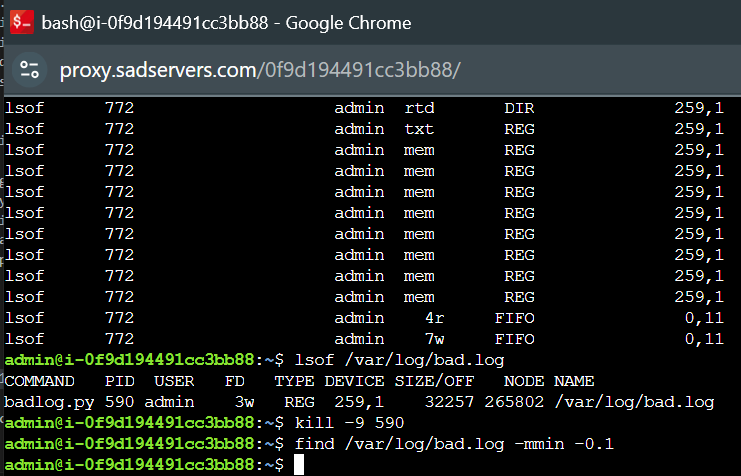
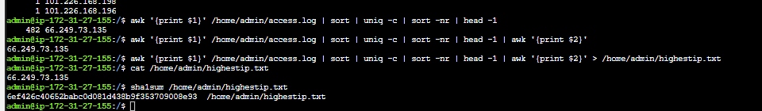

## Table of Contents 📚

- [SadServers Tasks](#sadservers-tasks)
  - [Scenario: "Saskatoon": Counting IPs](#scenario-saskatoon-counting-ips)

---

# SadServers Tasks

## Scenario: "Saskatoon": Counting IPs

**Description**: There's a web server access log file located at `/home/admin/access.log`. The file consists of one line per HTTP request, with the requester's IP address at the beginning of each line.

Find the IP address that has made the most requests in this file. The IP address is unique, meaning there is no tie. Write the solution into a file at `/home/admin/highestip.txt`. For example, if your solution is `"1.2.3.4"`, you can write it like this:

\`\`\`bash
echo "1.2.3.4" > /home/admin/highestip.txt
\`\`\`

**Test**: The SHA1 checksum of the IP address file can be verified with:

\`\`\`bash
sha1sum /home/admin/highestip.txt
\`\`\`

The expected checksum is: `6ef426c40652babc0d081d438b9f353709008e93`.

---

### Solution Approach

1. **Extract IP addresses from the log file**:  
   Use the `awk` command to extract the first column (the IP addresses) from the log file:

   \`\`\`bash
   awk '{print $1}' /home/admin/access.log
   \`\`\`

   This command will print all IP addresses in the log file.

2. **Count the occurrences of each IP address**:  
   To count how many times each IP appears, sort the output and use `uniq -c` to count occurrences:

   \`\`\`bash
   awk '{print $1}' /home/admin/access.log | sort | uniq -c
   \`\`\`

3. **Find the IP with the most requests**:  
   Sort the counts in descending order to get the IP with the most requests at the top:

   \`\`\`bash
   awk '{print $1}' /home/admin/access.log | sort | uniq -c | sort -nr
   \`\`\`

4. **Output the highest-requesting IP to a file**:  
   After identifying the IP, use `head -n 1` to get the IP with the highest request count and write it to the output file:

   \`\`\`bash
   awk '{print $1}' /home/admin/access.log | sort | uniq -c | sort -nr | head -n 1 | awk '{print $2}' > /home/admin/highestip.txt
   \`\`\`

   This command writes the IP address with the most requests to `/home/admin/highestip.txt`.

---

### Example Commands:

- `lsof /var/log/bad.log`
- `kill -9 585`
- `find /var/log/bad.log -mmin -0.1`

These commands confirm that the process is successfully killed!

---

### awk Explanation:

`awk` is a pattern scanning and processing language for performing operations on text files.

Example to extract the first column (IP addresses) from the log file:

\`\`\`bash
awk '{print $1}' /home/admin/access.log
\`\`\`

- `print`: Outputs the result to standard output.
- `$1`: Refers to the first field (in this case, the IP address).
